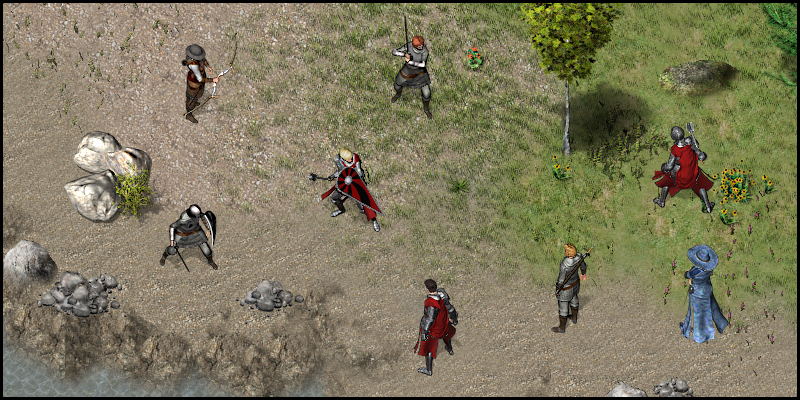
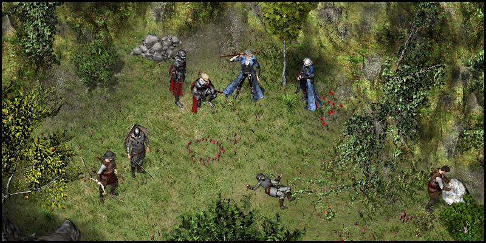
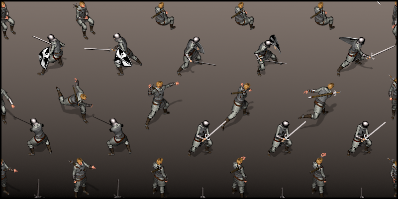
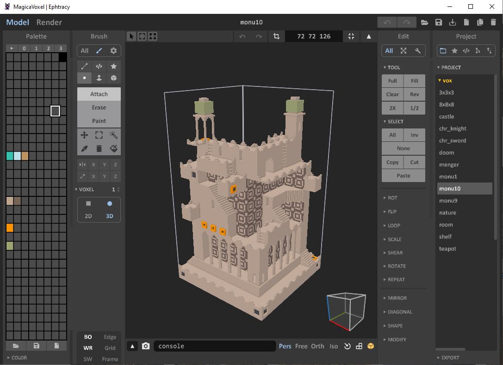
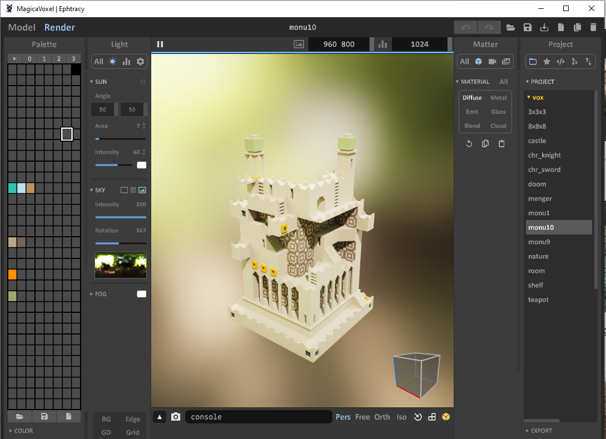

# Technical
In this document, we will discuss how a game assets will be made.

Im suggesting these options:
* 2D painting
* Voxel
* 2D + Voxel
  * 2D: background, ground, foreground, skybox layers etc..
  * Voxel: characters, buildings, interactive objects etc..

## 2D painting

 

 

## Voxel

 

* **Pros**
  * 3D lighting and physics are natively supported in Unreal/Unity (easy to implement)
  * More flashy realistic effects
  * Animation rigs are reusable
  * MagicVoxel is a light, free, open source software (just 3.3mb)
  * Compared to other 3D modelling software, MagicVoxel is far simplified. 
* **Cons**
  * Model creation will take some time
  * Animating 3D model will take some time
  * Learning curve
