# Nomad's Land (Working Title)

* **Be thorough, but don't be absolute.** ```Remember that everything must be allowed to change and evolve over the course of the project, and the design document is a general description more than a blueprint. If you end up with a totally different game to the one that you laid out in the design document, as long as it's better it doesn't really matter. ```
* **Don't be hesitant to name check other games;** ```it's often the best way to get across a point to yourself/your team members. That said, don't make that all your document is. ("The wit of Grim Fandango meets COD4-quality FPS meets LBP user-creation" sounds great, but doesn't explain what you're doing or how you're going to do it.)```
* **Write well.** ```Just because this is for your team's personal use doesn't mean that you shouldn't try to make it as readable and expressive as possible - remember, this is the document that you'll be looking back on during development to try to recapture the feelings and ideas you had about the project in the first place. ```


## Intro
The future is here in Mongolia, and the future is nomadic. With the assistance of advanced robotics, the most grueling of tasks in a pastoral life are automated, and much of the Mongolian people live as nomads of the future, permanently wandering through its open expanses. With communications tech that spans the whole country and high-tech homes that guarantee a traditional yet modern standard of living, these new nomadic Mongolians continue to participate in and reap the benefits of the global economy.

The engineer works on his blueprints next to the shimmering Selenge River, the programmer makes his software in the midst of the Dornod grasslands, the musician livestreams his performance in front of the Otgontenger Mountain; all happening as robotic assistants take care of the pastoral herd that make up their subsistence.

But not everyone here gets to live the mythology of 22nd century nomadism. The cities are depopulated and abandoned, mostly functioning as live-in factories for essential goods. As only the working poor were left to work in the cities, the urban areas have become impoverished, ruined and desolate, a blight upon a country famous for its scenery. You’re an elch, a local law enforcer sent to investigate the factory town of Bulagt that has recently lost communication with the rest of the country.

Once a city of 100,000 people, Bulagt is now almost a ghost town with only one factory still operating with a population that barely reaches 10,000. It is unclear what happened there, it may have been a power outage, an uprising, or something far, far worse. Nomad's Land is a New weird fiction-inspired top-down adventure game taking place in an urban marriage of both post-socialist and post-capitalist decay.

# :performing_arts: Characters 
## Main characters
* **Soronzonbold - Protagonist**. An elch who has been working at an örtöö (checkpoint in Mongolian) for the last 4 years, expecting to earn enough money to buy his own resources to become a nomad. Initially suspicious of the locals of Bulagt, Soronzonbold begins to change his view of them as he notices the class system that has kept the factory workers of Bulagt stuck in their living condition for decades.
* **Margad – Deuteragonist**. A young teenage girl that lives in Bulagt as the leader of the Union of Bulagt Filmmakers, a group of Bulagt children aspiring to create film in an impoverished town where none of the resources are available. Famous for the stacks of notebooks that she uses to write down ideas before she forgets them, Margad’s Union of Bulagt Filmmakers are locally known for their stage plays, where the children who have written screenplays, but has none of the filming equipment would act out their films in front of an audience.
* **Anand**. A fellow elch of Soronzonbold, and his appointed partner for the disappearance cases that happened in Bulagt. Anand disappears early on in the story as an inciting incident for Soronzonbold to take the case far more seriously. Throughout the game, Soronzonbold gets disrupted radio signals that seem to be sent by Anand, but its contents remain unclear. Anand's fate is only revealed in the final quarter of the game.

# :clapper: Rough Plot (TBD)
A local Naadam festival is about to be held near the ghost town of Bulagt, with many different career tribes setting up camp nearby in preparation of the celebration and games. But instead of getting to watch the games and enjoying the drinks, Soronzonbold and Anand are two elch sent by their örtöö to investigate the Bulagt town itself, for there were reported cases of disappearance in the area. Soronzonbold and Anand agrees to split up where Soronz visits the Naadam encampments, while Anand visits the town center.

Time passes and evening comes, but Anand disappears. Leaving Soronz alone to discover what had happened. As Soronz comes into the town at night, he ends up having to fight off a deformed and hostile drone. Befuddled by what the hell is happening, Soronz runs into a young girl called Margad. Margad reveals to him that there actually were far more people who disappeared in Bulagt, especially those from her friend circle that she calls the Union of Bulagt Filmmakers. While Margad is initially skeptical of Soronz's intentions, she eventually agrees to accompany Soronz in finding the people in exchange for Soronz buying her a video camera.

To Be Continued...

# :bulb: Concept & Reference 
## Artistic Style Outline
The setting is a ghost town full of blocky and brutalist buildings like drenched in the grey aura of stagnation all too common in the dwellings of post-socialist countries. But those buildings would be covered in corporate ads, billboards and product placement murals, as if this city was embarrassed of their socialist origin, and wanted to cover up socialist monochromatism with as much capitalist color as possible. As the city became depopulated, the grey blocks and the colorful ads would both be neglected, their mutual decay merging into a singular symbol of all-encompassing destitution that transcended any ideological aesthetic. A decay that symbolized neither the promises of socialism, nor that of capitalism were able to give nomadic Mongolia the fruits of development; and both were left to gather dust in the heaps of history. The images below were taken as reference, but imagine it a hundred times more dilapidated:

### Naive attempts to reclaim urban monotony that now decays just the same.
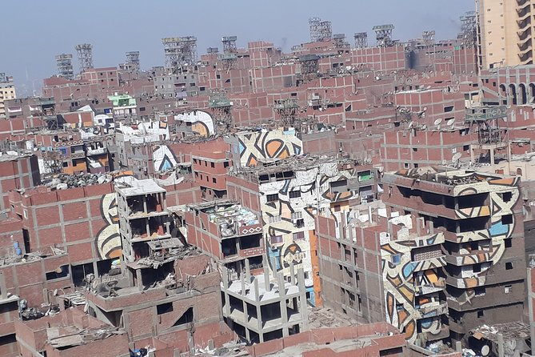

### Ads and billboards covering socialist-era buildings like a half-done paintjob over an old car.
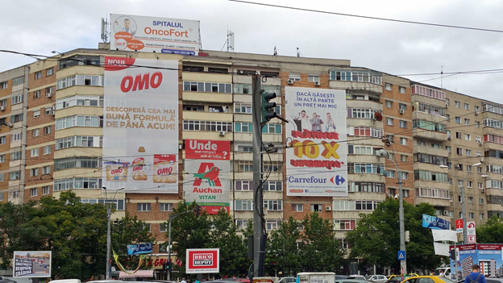

### Modern apartments whose constructions were abandoned halfway, like tall islands in a sea of unfinished walkways and dirty grass.
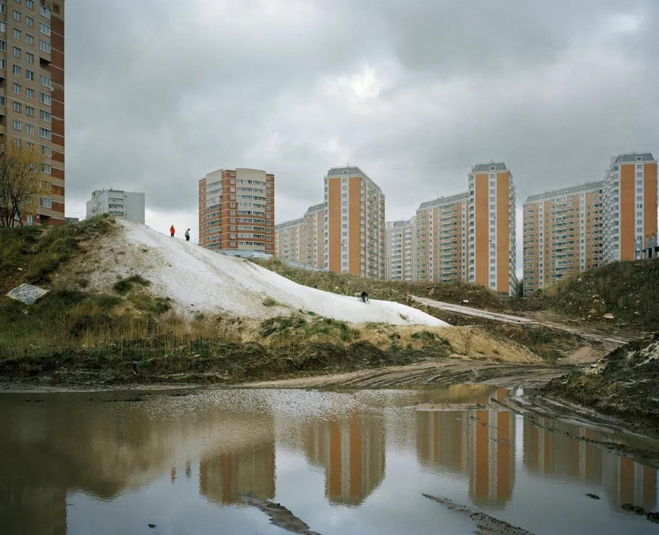

### The poor who have only the highrise left for accomodation, improvises in face of infrastructural deficiency.
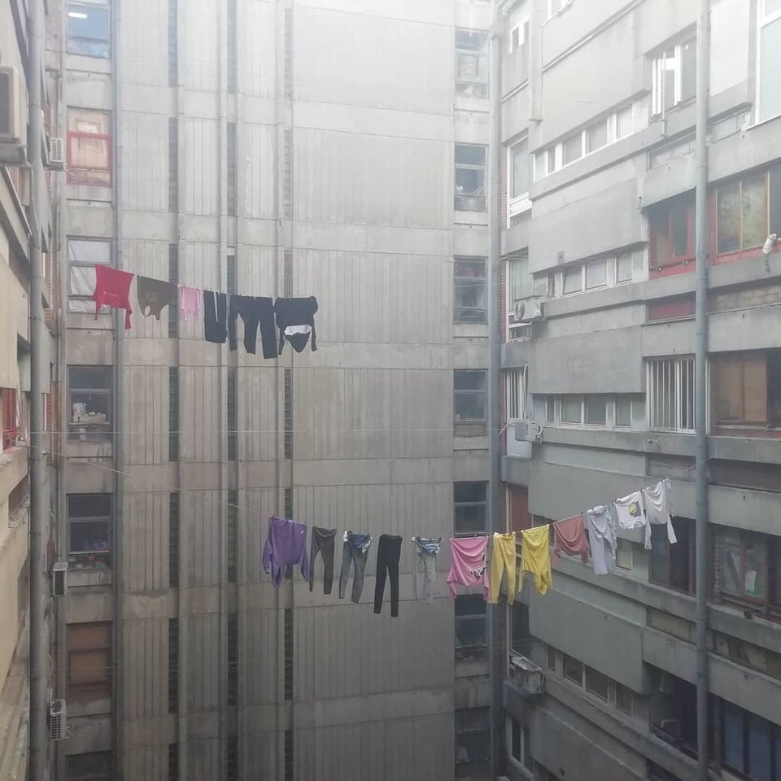

### Advertisement of parades, events and celebrations long ago. Decades passed since they happened, but no one bothers to replace them.
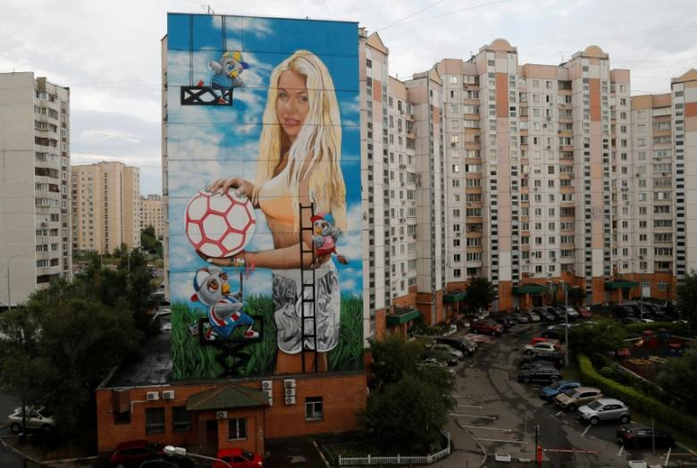

### Looming brutalist structures, infected in its peripheries by the decor of small businesses. Now both lingers as the part of the same rot.
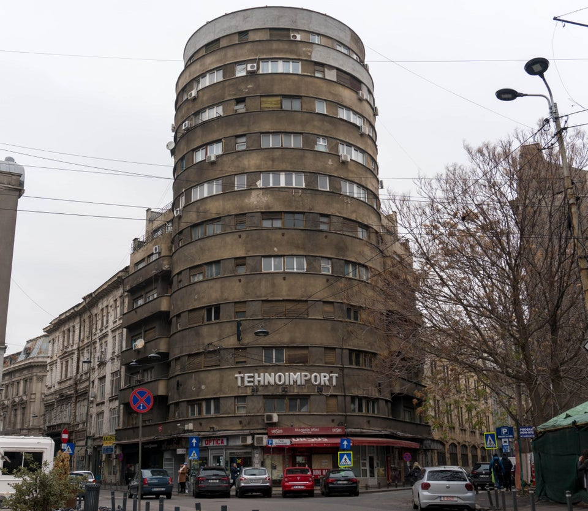


## Ideas

### Mail Tower
Mail towers are arguably one of the few actually modern buildings that can be found within Mongolia’s factory towns. A town could be in complete ruins where most of its inhabitants live in destitution, but the town’s Mail Tower will always be well-kept and in good condition. The goods and products of the factory town are stored in the Mail Towers, where delivery drones across the country arrive to pick them up and deliver them onto nomadic citizens that ordered them online. As the most fundamental vein of Mongolia’s non-nomadic economy, the Mail Towers are highly protected by the government. Especially due to an infamous incident where extremist terrorists once used a Mail Tower to distribute goods rigged with bombs.

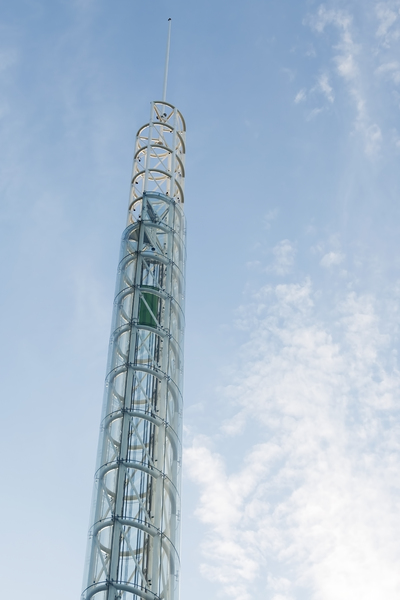

### Örtöö
Small relay stations spread around the country and operated by government workers, the örtöö serves as a base of law enforcement, government contact center and a Wi-Fi provider for the people of the steppes. Most örtöös exist 40-80 kms apart from each other, and are usually operated by 4-8 people, known as elch. Our main character Soronzonbold is one of the aforementioned elch, and as he investigates the desolate city of Bulagt, his fellow elch will provide him with information and assistance from their örtöö home base.

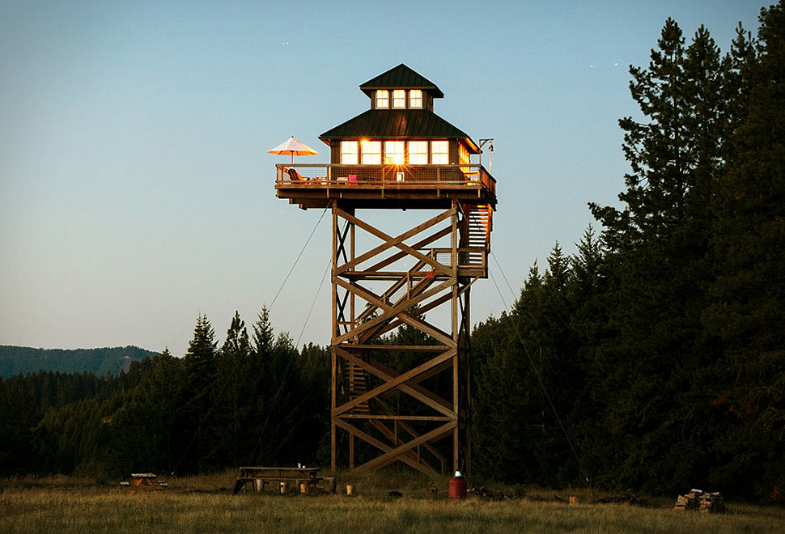

### Dankhar
The most fundamental piece of technology that allowed the people of Mongolia to pursue a nomadic life in the 22nd century, dankhars (combination of dankh and bankhar) are a variety of robots meant to fulfill purposes such as herding cattle, protecting them from carnivorous wildlife, detecting appropriate pastures to prevent overgrazing, and meat preparation/butchery. With the struggles of pastoral life made easier through the Dankhars, most nomads get to pursue their own careers and hobbies the same way they could back in the urban cities. The last remaining factory in Bulagt is in fact, a dankhar factory. By nature of being the most strategically important of Mongolian industries, the cases of disappearance around the Bulagt dankhar factory is the primary reason why Soronzonbold is sent to investigate the town.

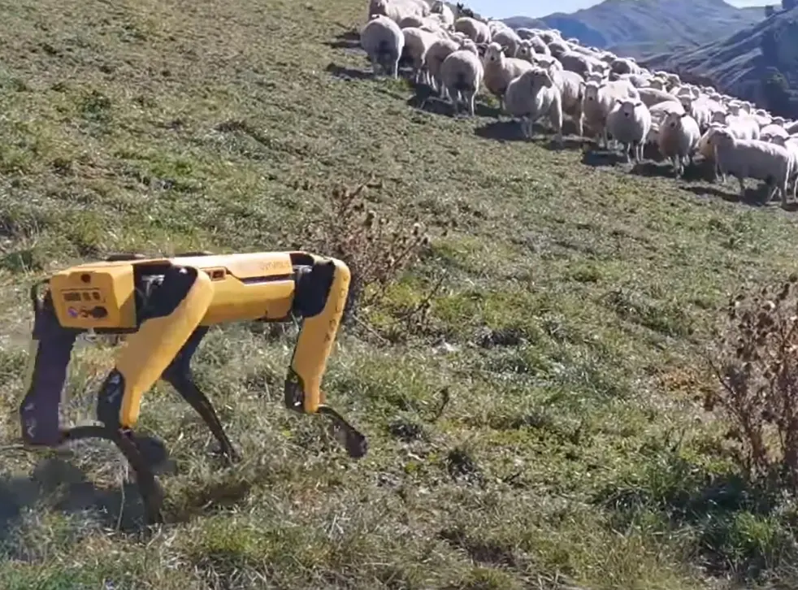

### Death Worms
Death worms are massive robotic worms that lurk in the deep underground of the Mongolian steppes. These worms were originally created for the purpose of discovering and digging out untapped and hidden natural resources such as oil and iron for national use. The death worms travelling underground causes small earthquakes to any ground that stands above it. While the people demanded the government to discontinue the use of death worms due to their negative effects on the local ecology, certain worms had gone rogue and went on to independently live across the endless steppes. Eternally looking for more oil, more iron and more copper. But with no one left to reap the benefits of their discoveries. While it is mostly assumed that these worms have died out, certain urban legends and sightings seem to allude that these marvelous giants still do exist.


### Career Tribes
Despite the extremely spread-out nature of nomadic Mongolians, most of them are loosely organized into tribes based on their profession (Engineering tribe, craftsmen tribe, programming tribe, etc.). A free association of those united in their career prospects, tribe members usually travel together while still living in significant distances from each other. Meeting up every few months to democratically reach decision-making in issues such as relocation, tribe budget spending, or the admittance and professional tutelage of new members.

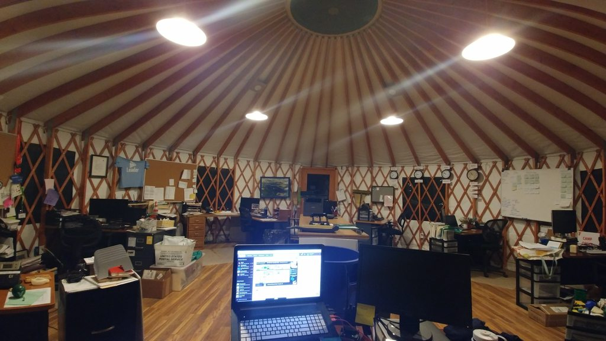

### Expat Nomads
Expat Nomads are members of the tribe that work online in companies or organizations across the world, and thus have to coordinate their sleep cycle to the timezone of their employer organization. Famously includes those employed by companies from the U.S. East Coast, which has a precisely 12-hour timezone gap with Mongolia, effectively making these nomads nocturnal. By nature of working in international enterprises, the expat nomads earn far more money compared to their fellow tribesmen and are able to budgetarily contribute to the tribe far greater, and thus are usually accompanied by assistant roommates that can take care of the actual day-to-day businesses while the expat nomads get some rest.

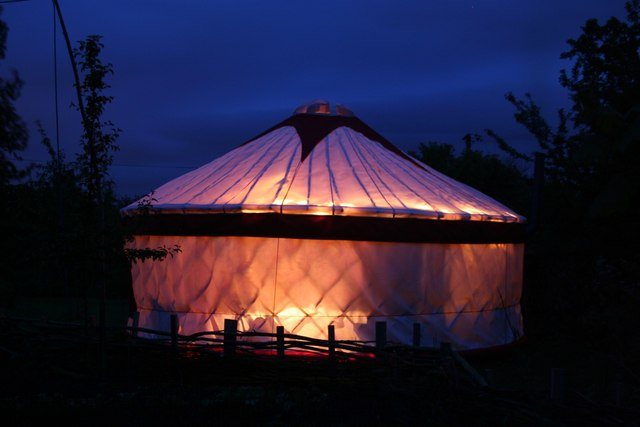

### Union of Bulagt Filmmakers
A group of Bulagt teenagers aspiring to become filmmakers despite having pretty much no access to any filmmaking resources. Often writing down ideas on any notebook or paper they can salvage from the town, the kids come together to act out each other’s screenplays in forms of impromptu plays. The films they imagine in their head will only get to exist at that very moment. The living conditions of the town have pretty much guaranteed that these kids have no real way out of their destitution into becoming actual filmmakers. And the town’s adults don’t see much value in their plays, preferring to have the kids continue to work in factories instead.

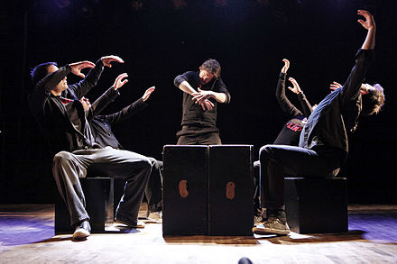

### Naadam Festival
The traditional festival of Naadam celebrated by Mongolia featured three prominent sports: wrestling, archery and horse racing. Historically, these three sports were the fundamental roots of skills required for the Mongolian military. And as such, the Naadam festival was essentially an indirect form of military training incentivization for the nomadic people. But as the 22nd century arrived, and the pastoral lifestyle became more and more popular, the Naadam festival soon became popular again, with a twist. As a confederation of syndicalist tribes, the upkeep of a centralized military for self-defense became harder and harder to manage. Once the outdated central army was phased out of society, the right to keep and bear arms was granted to Mongolia's nomadic citizens (the urban populace were not granted the same privilege) for the sake of ensuring the nomads' security without the need of a centralized force.

Nomads prefer not to keep personal guns, instead preferring to outfit their yurts and dankhars with rifles and turrets. With the advent of this system of personal protection, the Naadam festival began to shift away from its traditional games that represented outdated military skills, onto the new sports that represented the new ways the nomads enforced their security. New sports such as dankhar battles, human vs. robot fights, competitive hacking and motor races soon became the new games of the Naadam festival.

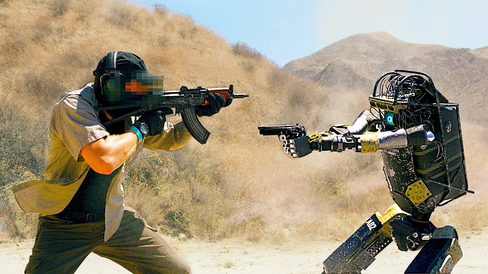

### The Factory Class
As the Industrial Revolution began taking hold, factories became symbols of a new way of life, the next stage of human development. For it was the factories that cemented the superiority of urban living compared to the rural one; for they represented good paying jobs, social mobility, and a symbol of pride for a nation aspiring to call itself 'developed'. In 22nd century Mongolia however, factories no longer hold the same cultural significance it once did. It is seen as a necessary evil, ancient facilities made to produce goods and materials that nomad tribes cannot. It is seen as a lower class symbol, for the overwhelming amount of its workers are those too poor to become nomads. Factory workers are seen the same way that the 21st century urban population saw its rural counterpart: people too backward to integrate into modern society, but also working all the destitute but essential jobs that the middle-to-upper class people would never take.

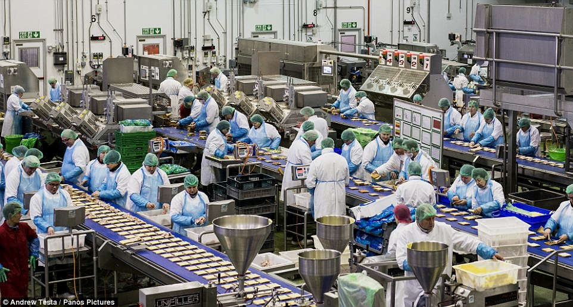

### The Great Switch
The Great Switch is a controversial phenomenon that happened throughout the 22nd century in Mongolia where the country's well-off urban population began to leave cities in favor of the mythologized lifestyle of futuristic pastoralism. With their technological advantage, the new nomads with their greater financial and robotic resources began to suffocate the livelihood of traditional nomadic Mongolians, who were driven to live in the decaying cities for their traditional lifestyle was outcompeted and taken over by pastoral gentrification. The factory class of Mongolia is almost entirely formed out of the descendants of these old nomads that had to come to the cities to survive, an incredible irony in the face of a society that took pride in reviving their old culture.

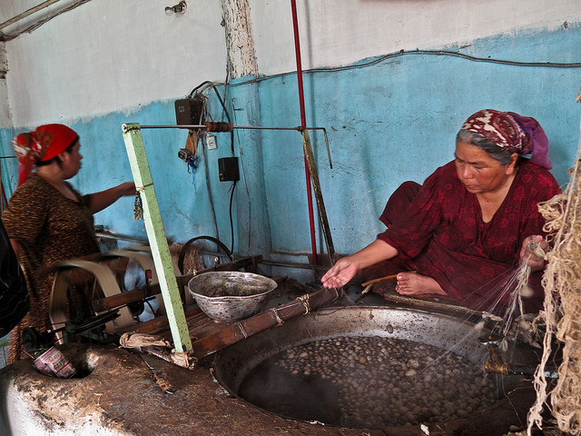

### Lovecraftian Factories
Factories, along with mail towers, are the dominant species in cities, they are given the greatest accomodation and consideration. And as such, factories exist as enormously large complexes in comparison to any other building, like Lovecraftian eldritch giants that loom over its decaying dominion. These factories are mysterious places, for there does not seem to be managers or supervisors, only workers obediently doing their tasks. While the state continues to claim that these factories are under government control and refuses to elaborate further, nothing on the ground seems to indicate so. Government officials do not visit to inspect factories, there never seems to be any person managing it, the only things that enter and exit them are its workers and drones used for supply transportation. There can sometimes be strange occurrences of nature that occur near these facilities, such as rivers running backwards, or plants unfamiliar to native flora growing nearby.

In essence, these factories are alive. It's unclear exactly why they are so and their intentions remain unclear. But the nomadic people of Mongolia have grown to see these factories not unlike the old spirits of the mountains and the rivers. The factories seem to each have personalities, moods and things that please them the most; discovering and interpreting such has led to a revived culture of shamanism and ceremonialism among the people.

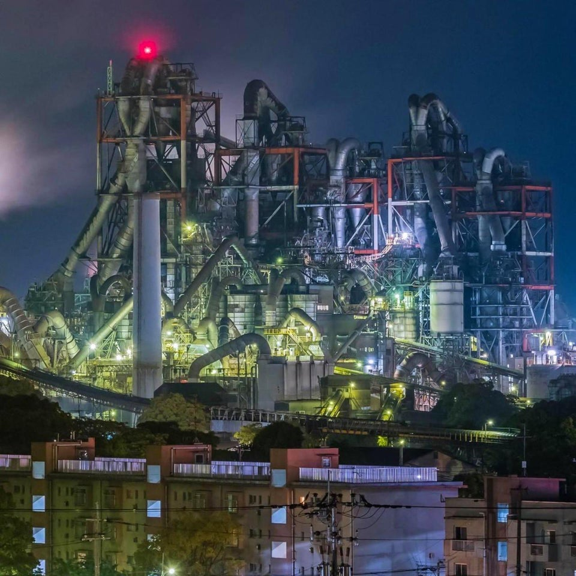

### Final Notes on Ideas
The design philosophy for the ideas present in the game come from three different inspirations, and all new ideas should ideally account for these three perspectives.

1. ### Modernized Traditionalism
While the society presented in the game shows a revival of a traditional nomadic lifestyle, it does not necessarily mean that traditional norms and art made a comeback. Old traditional concepts that served a deeper sociopolitical purpose such as Naadam or örtöö are either repurposed to fit the needs of futuristic nomadism, or subverted entirely with its name being the only thing left that connects it to a previous concept. Traditions that are deemed unfit or counterintuitive (social conservatism, for example) are abandoned entirely.

Just because the majority of people are nomadic does not mean bows and arrows became the national weapon of choice again. With that in mind, it is important to finally remember that the vision of this game is still meant to be something that could have only been imagined by those who lived in Mongolia. But the inspirations from Mongolian culture shouldn't be copy-and-paste jobs from old legends or Mongoliin Nuuts Tovchoo, but a reinterpretation made in the context of a society that chose to let it exist.

2. ### Imagining Postcapitalism
"It is easier to imagine an end to the world than an end to capitalism." is a famous quote by Slavoj Žižek that explains not only the conditions of capitalist realism, but also the trappings of other speculative science-fiction media that traps itself in either a world of accelerated capitalism (cyberpunk), accelerated statism (brutalism), a redeemed version of either (solarpunk), or simply that of post-apocalypse. One of our goals must be to articulate a sci-fi aesthetic as an alternative to the aforementioned genres without reaching into overt utopianism.

Of course, while there are vestiges of capitalism still present, neoliberalism for the most part has been phased out. The most prominent ideas such as the career tribes and the mostly-anarchist society are mostly inspired by the writings of Daniel De Leon and Pierre-Joseph Proudhon. The world here does not necessarily have to be perfect, but simply as workable as capitalism, if a bit better. Please remember that nomadism in the 22nd century is not necessarily a retreat in living standards, it is in fact an indirect form of subsistence post-scarcity.

3. ### Subject to Subversion
Never forget that despite the nomadic and postcapitalist setting of this game, the primary subject of exploration for the main story is inspired by Lovecraftian stories of entities and deities whose existence and goals were too incomprehensible for the human mind to fully understand. The combination of these deities with the sci-fi setting is what makes this idea something that takes place in the New weird genre. Implementations of such elements can be seen in other games such as Control made by Remedy Entertainment, or the avant-garde horror projects of Kitty Horrorshow.

The New weird elements would come more and more into the forefront as Soronzonbold starts actually exploring inside the Bulagt Dankhar Factory. Design elements and worldbuilding ideas are accounted in their subvertability, how can things like dankhars or mail towers be converted into horror? How can the initially wondrous sci-fi elements of this world be transformed into sources of fear and paranoia down the line?

# :electric_plug: Gameplay 
## Camera & Mechanics
An orthographic 2D top-down camera. 

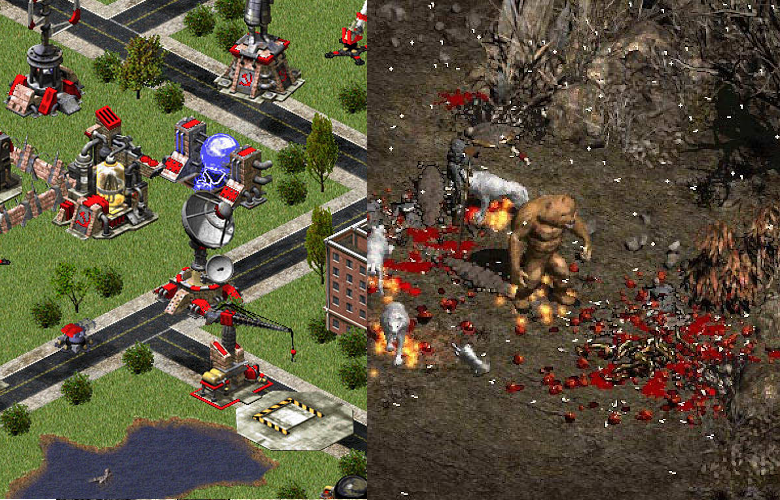

### Input mechanics
* W,A,S,D or arrow keys for movement.
* Mice cursor to aim
* Number keys and additional Q,E,R,T,Space keys for action
* Esc key for menu and pause

### Gameplay features
* Item loop & inventory system
* Level progression
* No recharging healthbar
* No minimap
* No autosave

### Storry telling
* NPC dialogue
* Item description
* Cutscene

## User Interface
### In Game Interface
Main gameplay interface

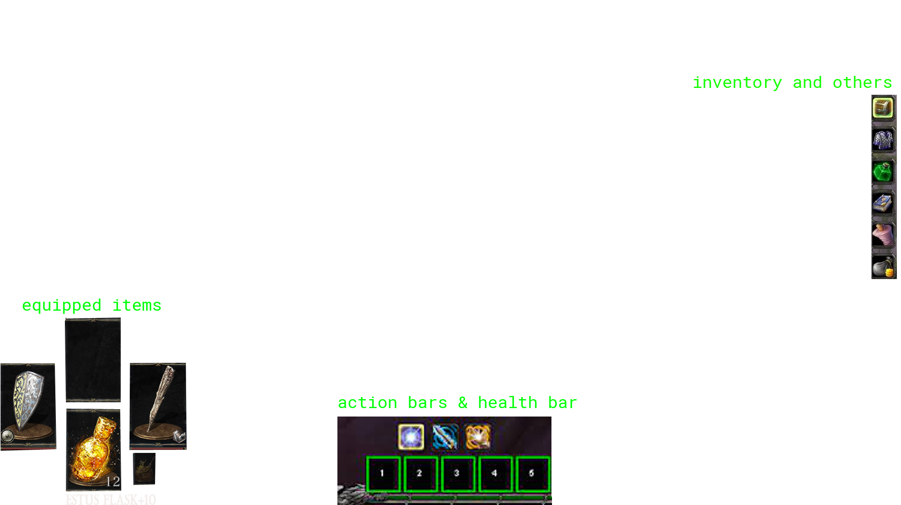

# :notes: Audio & Music 
## Soundtrack
Dark and slow themed children's song cover
* Example: [Dezzaired - London Bridge](https://youtu.be/qFPHtXvHRSE)
* Game selected song: [Зургийн хичээл](https://youtu.be/HAsMMncgQV8)

## Background music (TBD)
In game loopable music (Post-Britpop Blur as an inspiration for factory or urban areas)
* Example: [Blur - Essex Dogs](https://www.youtube.com/watch?v=-I2P2bAfiXY)
* Example: [Blur - Trailerpark](https://www.youtube.com/watch?v=Uq6ESaWItTU)
* Example: [Blur - Jets](https://www.youtube.com/watch?v=OCuw18yIRjE)

## Sound (TBD)

## Voice Acting (TBD)

# :triangular_ruler: Game Flow Diagram
The intent of this section is to lay out, step by step, what the player experiences from as soon as they turn on the game until the end. While this can be generic and use a lot of loops (ie. Start Game -> Cutscene -> Tutorial -> loop(Cutscene -> Level -> Results Screen) -> End), it's probably a good idea to attempt to envisage how your game might be able to break up the monotony that is evident in that design.
The great thing about this section is it gets you really thinking about what your game is and how it is presented, as opposed to the amalgam of disjointed ideas in your head. The deeper you get into this Game Flow Diagram, the more confident you will be about what your game is precisely made up of, and what the experience of playing it will be.

### Progression diagram

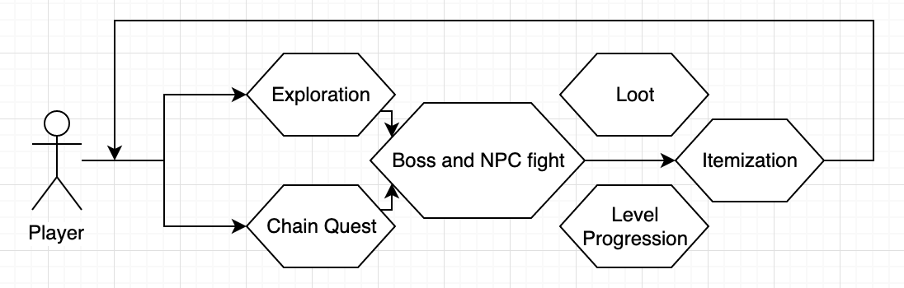

# :clipboard: Additional Ideas and Possibilities 
This final section is a bit of an amalgam of everything that didn't fit in the sections before hand. It's an appendix of all of the things that you didn't think were necessarily core to the game, but you'd like to consider along the way. It's also for alternate possibilities - for instance, if you had two main characters in mind, put the better one in the main document, and then the alternate here. Finally, if you have any ideas that you're not sure about, but would like to prototype, then this is the place for that stuff as well.
